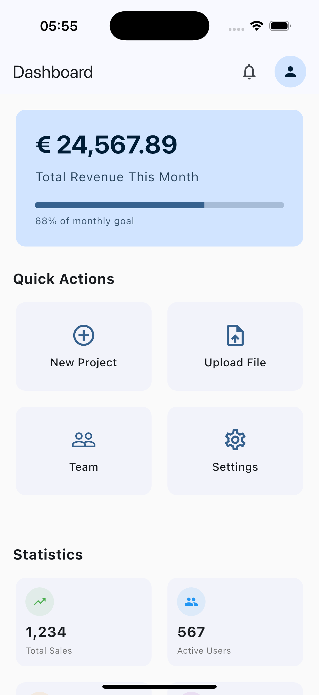
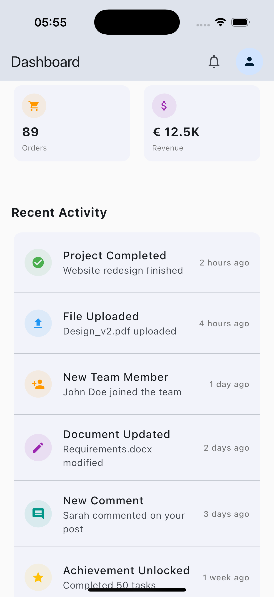

# Flutter Dashboard UI Template (Material 3)

A clean, production-ready **Flutter Dashboard UI template** built with **Material 3**.

This project focuses purely on **UI and layout** and is intended as a starting point for real-world Flutter applications.

Full template available on Gumroad:  
👉 https://griseo.gumroad.com/l/dev-flutter-dashboard-template

---

## Features

- Material 3 design
- Dashboard shown directly on app start
- Overview / hero card with progress indicator
- Quick action cards
- Stats cards
- Recent activity list with mock data
- Clean and readable widget structure
- Fully commented source code

---

## What this template does NOT include

- No navigation
- No routing
- No external packages
- No backend or business logic

---

## Screenshots

---

## Project Structure

The project is intentionally kept simple:
- `main.dart` directly loads the dashboard screen
- UI components are split into small, reusable widgets

---

## How to run

1. Clone the repository
2. Run `flutter pub get`
3. Run `flutter run`

The dashboard will be visible immediately on app start.

---

## License

This repository is for demonstration and marketing purposes.  
The full template is available on Gumroad.
